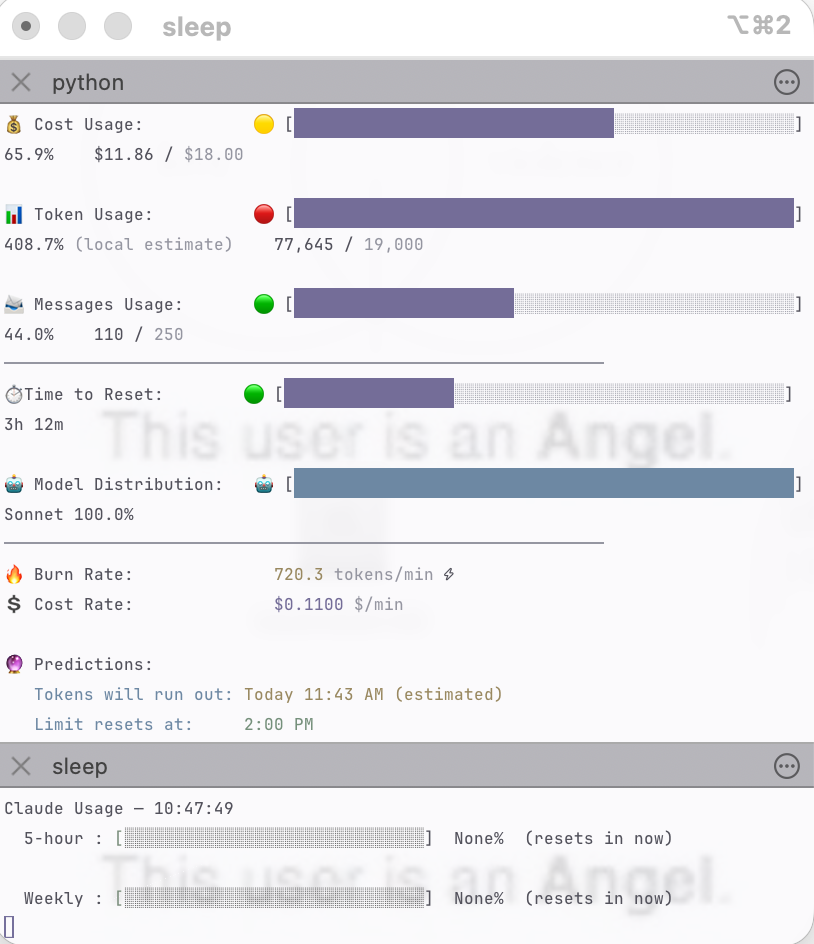

# ISEI's Angel Core Claude Usage Monitor Customize

[](https://opensource.org/licenses/MIT)
[](README.md)

[**Maciek-roboblog/Claude-Code-Usage-Monitor**](https://github.com/Maciek-roboblog/Claude-Code-Usage-Monitor) の個人用フォークです。ツール本体の功績はすべて **Maciek** さんのもの。このフォークは機能を何も足していません。ダッシュボードの雰囲気を柔らかいパステル調（"Angelcore"）に塗り替えて、途中で見つけた本物のバグを1つ直しただけです。本家が欲しいなら、活発にメンテナンスされている[オリジナル](https://github.com/Maciek-roboblog/Claude-Code-Usage-Monitor)をどうぞ。このリポジトリは、ちょっとした個人的な作業環境の記録を、誰かの役に立つかもしれないので公開しているだけのものです。オリジナルのREADMEは[README.upstream.md](README.upstream.md)にそのまま残してあり、MITライセンスも変更していません。



---

## 事前に必要なもの

- macOS + [iTerm2](https://iterm2.com) — 自動起動スクリプトはiTerm2専用です（`claude-monitor` 自体はどこでも動きます）
- インストール用の [uv](https://docs.astral.sh/uv/)
- 名前が正確に **Monitor** のiTerm2プロファイル：iTerm2 → 設定 → Profiles → **+**。見た目は自由です（配色は `claude-monitor` 自体が持っていて、プロファイルには依存しません）が、参考までに上のスクリーンショットで使っているフォントは以下の通りです（Profiles → Text タブ）。

  | 設定項目 | 値 |
  |---|---|
  | フォント | JetBrainsMonoNL Nerd Font |
  | スタイル | Medium |
  | サイズ | 8 |
  | 水平方向の間隔 | 100% |
  | 垂直方向の間隔 | 132% |

  Nerd Fontはあれば嬉しい程度で必須ではありません（アイコンは普通のUnicode絵文字なので、等幅フォントなら何でも動きます）。垂直方向132%というゆったりした間隔が、あの余白のある雰囲気を作っています。100%に近づけるほど、同じ内容がより低いウィンドウに収まります。
- `PATH` に `~/.local/bin` が通っていること — `uv tool install` はここに `claude-monitor` を置きますし、セットアップスクリプトもフルパスではなく名前で呼んでいます。通っていなければ、uv自身がちゃんと教えてくれます。

---

## インストール

```bash
uv tool install git+https://github.com/IIISEIII/Angel-core-Claude-Code-Usage-Monitor.git
```

さらに、iTerm2の自動起動レイヤーもお好みで。

```bash
mkdir -p ~/.claude-monitor
cp macos-setup/weekly-status.sh ~/.claude-monitor/
chmod +x ~/.claude-monitor/weekly-status.sh

mkdir -p ~/Library/"Application Support"/iTerm2/Scripts/AutoLaunch
cp macos-setup/autolaunch.applescript ~/Library/"Application Support"/iTerm2/Scripts/AutoLaunch/claude-monitor-autolaunch.scpt
```

次にiTerm2を開くと、2ペインのウィンドウが勝手に立ち上がります。もう自分で起動する必要はありません。それ以外——インストールオプション、`--plan`、他のフラグ、機能一覧など——はすべて[README.upstream.md](README.upstream.md)（英語）を参照してください。ここで変えたところ以外は何も変わっていません。

---

## オリジナルからの変更点

ソースファイル3つを編集し、[`macos-setup/`](macos-setup/) 配下にスクリプトを4つ追加しています。

### 色

`themes.py` — ライト/ダーク両方のテーマテーブルを、upstreamのxterm-256パレットから、もう少し静かな配色に書き換えました。

| 役割 | Hex | 用途 |
|---|---|---|
| `foreground` | `#3F3E4A` | メインテキスト |
| `soft_text` | `#6F7284` | サブテキスト |
| `muted` | `#8A8B98` | 薄字・区切り線・バーの未達部分 |
| `blue` | `#557C9C` | info、Sonnetモデル、max5プラン |
| `cyan` | `#4F8D91` | チャートの線 |
| `lavender` | `#77709F` | ヘッダー、Opusモデル、max20プラン |
| `purple` | `#675D91` | プログレスバーの塗り |
| `pink` | `#A66F87` | proプラン |
| `rose` | `#AE6677` | エラー表示 |
| `green` | `#5F856B` | 成功表示 |
| `yellow` | `#927B48` | 警告表示 |

ダークモードは同じ色相を明るくしただけです。プログレスバーの塗りは使用率段階で色分けせず、紫で統一しました。upstreamでは「バー用」の段階判定と「絵文字用」の段階判定が時々食い違い、落ち着いた黄色🟡の隣に赤段階の色のバーが並ぶ、ということがあったからです。段階を伝える役目は絵文字だけに任せ、バーはただ静かに埋まっていきます。

### `--no-header`、今度こそ本当に

`session_display.py` — upstreamの `--no-header` はタイトルバナーを隠すだけで、冒頭の空行2つと末尾の「Active session」フッターは無条件に出力されていました。両方とも同じフラグの条件に含めたので、`--no-header` は名前の通り、最初の行から最後の行まで、余分なものは何も付かなくなりました。

### scrollbackの幽霊

`display_controller.py` — これは好みの問題ではなく、正真正銘のバグでした。`LiveDisplayManager` はRichの `Live` を `vertical_overflow="visible"` で作っていました。ペインの高さを内容ぴったりに詰める（`--no-header` はまさにそれを誘発します）と、更新のたびに本物のターミナルスクロールが1回起きて、`Live` 内部のカーソル位置管理が永久にズレます。あとでスクロールして見返すと、更新のたびに増えた古いフレームの幽霊たちが何十個もscrollbackに積み重なっている、という状態でした。`vertical_overflow="crop"` に変えて、スクロールの代わりに単純に切り詰めるようにしたら解決。ペインの高さを内容とぴったり同じにした状態で60回以上更新を確認し、幽霊は出なくなりました。

### iTerm2レイヤー

`macos-setup/` — upstreamの機能ではなく、こちらの自動化です。`autolaunch.applescript` はiTerm2起動時に2ペインのウィンドウを開き、サイズを固定します（上：ダッシュボード用21行、下：ステータス表示用5行——どちらもそのコンパクト描画にぴったり収まるサイズ）。`weekly-status.sh` は同じ `--api` の使用量キャッシュを読み、upstreamのダッシュボードには直接出てこない **5-hour** / **Weekly** のバーを表示します。ポーリング間隔はデフォルトの180秒ではなく60秒。`combined-monitor.sh` は、ペイン分割をしたくない人向けの1ペイン版です。

同じような構成を真似る人向けの豆知識：iTerm2で分割ペインの `rows` を変更すると、実は「ウィンドウ全体」がリサイズされ、直近に触った方のペインに合わせて広がり、もう片方はそのままのサイズで据え置かれます。だから小さい方のペインを先に、ダッシュボード側を最後に指定する必要があります。順番を逆にすると、計算が合わなくなります。

---

## ライセンス

MIT、upstreamと同じです。[LICENSE](LICENSE) 参照。Copyright (c) 2025 Maciej（オリジナル作者）、上記の変更部分は (c) 2026 ISEI。
